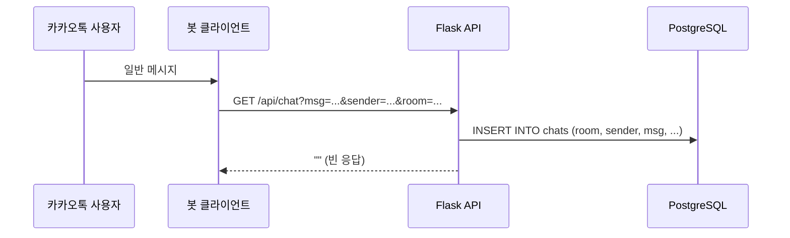
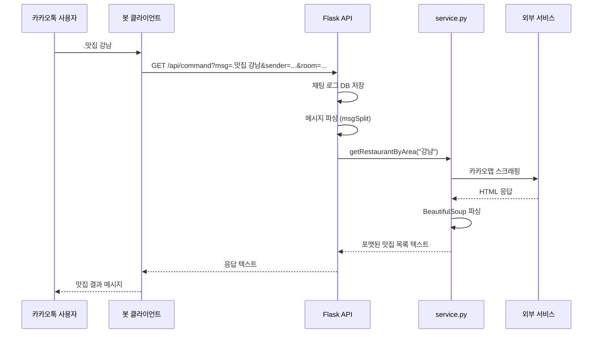
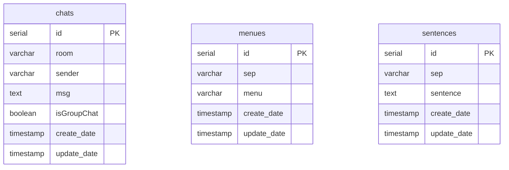

# Architecture

## 전체 시스템 아키텍처

```
┌─────────────┐     메시지 수신      ┌───────────────┐
│  카카오톡     │ ──────────────────→ │  봇 클라이언트   │
│  사용자 채팅  │ ←────────────────── │  (자동응답)     │
└─────────────┘     응답 반환        └───────┬───────┘
                                             │ HTTP GET
                                             ▼
┌───────────────────────────────────────────────────────┐
│                  KakaoBot-API (Flask)                   │
│                                                        │
│  ┌──────────────────────────────────────────────┐     │
│  │ api/main.py — 라우트 핸들러                    │     │
│  │                                               │     │
│  │  /api/chat    → 채팅 로그 저장                 │     │
│  │  /api/command → 명령어 파싱 & 응답 생성         │     │
│  └────────────────────┬─────────────────────────┘     │
│                       │                                │
│  ┌────────────────────▼─────────────────────────┐     │
│  │ api/service/service.py — 비즈니스 로직         │     │
│  │                                               │     │
│  │  날씨 조회, 맛집 검색, 로또 생성               │     │
│  │  채팅 랭킹, 뉴스 검색, 영화 목록 등            │     │
│  └────────────┬──────────────┬──────────────────┘     │
│               │              │                         │
│  ┌────────────▼────┐  ┌─────▼──────────────────┐     │
│  │ PostgreSQL DB    │  │ 외부 서비스 스크래핑     │     │
│  │ (채팅/메뉴/문장)  │  │ Daum, Naver, 카카오맵  │     │
│  │                  │  │ signal.bz, 메가박스    │     │
│  └─────────────────┘  └────────────────────────┘     │
└───────────────────────────────────────────────────────┘
```

## 요청 처리 흐름

### /api/chat — 채팅 로그 저장



### /api/command — 명령어 처리



## 명령어 파싱 로직

`api/main.py`의 `command()` 함수에서 메시지를 파싱합니다.

```
수신 메시지 분석
│
├─ "vs" 포함? → getVs() (랜덤 선택)
│
└─ 첫 글자 "."? (명령어 접두사)
   │
   ├─ .안녕/.명령어/.도움말/.help → 매뉴얼 출력
   ├─ .넌뭐야 → 자기소개
   ├─ .구글 [검색어] → googleSearch()
   ├─ .맛집 [지역] → getRestaurantByArea()
   ├─ .로또 [숫자] → getLottery()
   ├─ .채팅순위 [기간] → getChatRank()
   ├─ .한강온도 → getHanRiverTemp()
   ├─ .실검 → realtime()
   └─ .영화 → getMovieList()
```

## 데이터베이스 스키마



## 웹 스크래핑 전략

| 서비스 | 방법 | 라이브러리 |
|--------|------|-----------|
| 날씨 (다음) | 동적 렌더링 | Playwright |
| 맛집 (카카오맵) | 동적 렌더링 | Selenium |
| 한강 온도 | 정적 HTML | requests + BS4 |
| 실시간 검색어 | 동적 렌더링 | Selenium |
| 영화 목록 | 동적 렌더링 | Selenium |
| 뉴스 검색 | 정적 HTML | requests + BS4 |

## Vercel 배포 구조

```json
// vercel.json
{
  "builds": [{ "src": "api/main.py", "use": "@vercel/python" }],
  "routes": [{ "src": "/(.*)", "dest": "api/main.py" }]
}
```

모든 요청이 `api/main.py`로 라우팅되며, Vercel의 Python 서버리스 함수로 실행됩니다.

## 보안 고려사항

- `DB_URL` 환경변수로 데이터베이스 접속 정보 관리
- `.env` 파일 버전 관리 제외 (`.gitignore`)
- 입력값 검증 및 예외 처리 (`try/except`)
